# **Super-charging content production with Godot addons**

Building a pipeline to produce game content predictably.

---

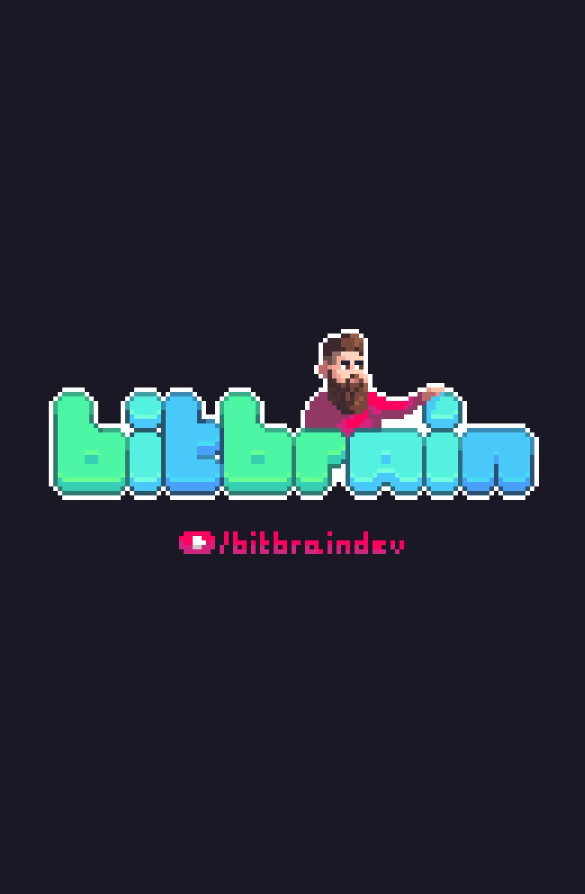
# @bitbrain

- working on a dwarven pixelart RPG! 💎⛏️
- maintainer of **pandora** and **beehave** 🐝
- Godot = 💖

---
# Godot's Design Philosophy

> [...] new features from the core developers often focus on what will benefit the most users first.

source:
https://docs.godotengine.org/en/stable/getting_started/introduction/godot_design_philosophy.html

---
# Terminology

- **addon** = third-party code and assets (including plugins)
- **plugin** = a Godot editor plugin (requires `plugin.cfg`)
- **extension** = extends Godot's core via C++ through the GDExtension interface (requires `*.gdextension`)
- **module** = compiled with Godot's core

---
# Plugins

Example: `addons/dialogic/plugin.cfg`
```javascript
[plugin]

name="Dialogic"
description="Create dialogs, characters and scenes to display conversations in your Godot games.
https://github.com/coppolaemilio/dialogic"
author="Emi, Jowan Spooner, Exelia, and more!"
version="2.0-Alpha-10 (Godot 4.1.2)"
script="plugin.gd"
```

source:
https://github.com/coppolaemilio/dialogic/blob/main/addons/dialogic/plugin.cfg

---
# GDExtensions

Example: `addons/fmod/fmod.gdextension`

```javascript
[configuration]
entry_symbol = "fmod_library_init"
compatibility_minimum = 4.1

[libraries]
windows.editor.x86_64 = "res://addons/fmod/libs/windows/libGodotFmod.windows.editor.x86_64.dll"
windows.debug.x86_64 = "res://addons/fmod/libs/windows/libGodotFmod.windows.template_debug.x86_64.dll"
windows.release.x86_64 = "res://addons/fmod/libs/windows/libGodotFmod.windows.template_release.x86_64.dll"
```

source:
https://github.com/utopia-rise/fmod-gdextension/blob/master/demo/addons/fmod/fmod.gdextension

---

# Addon Ecosystem

Exploring the categories of Godot addons.
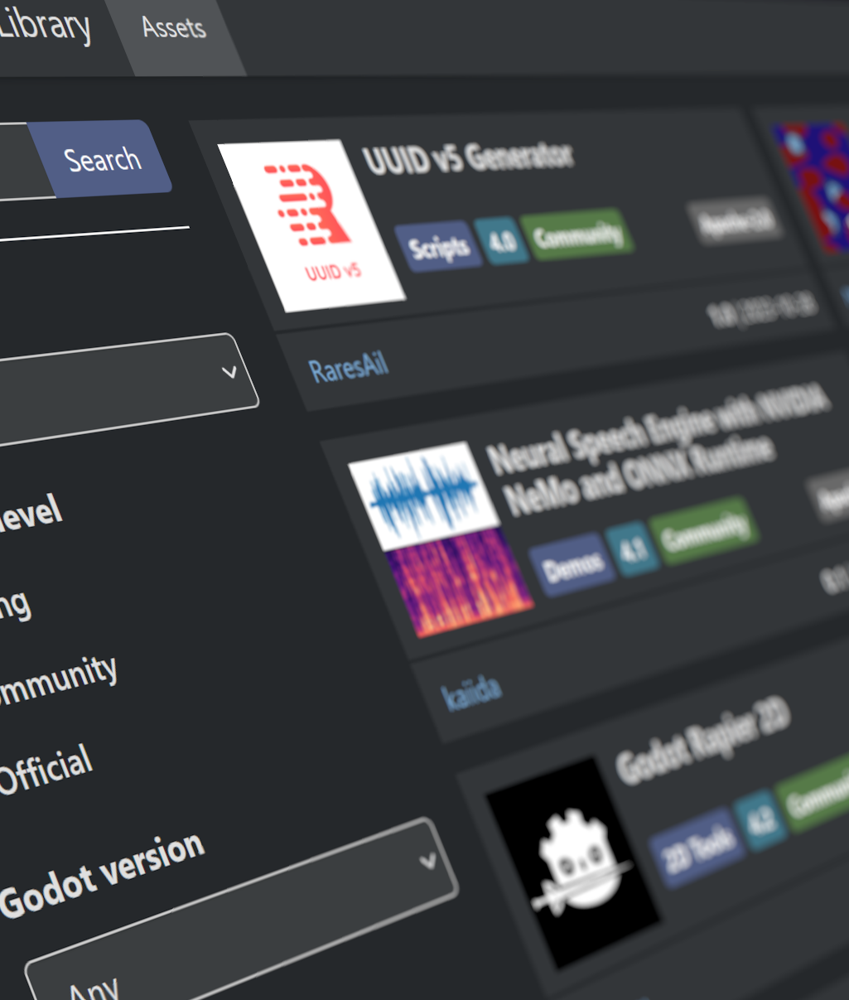

---

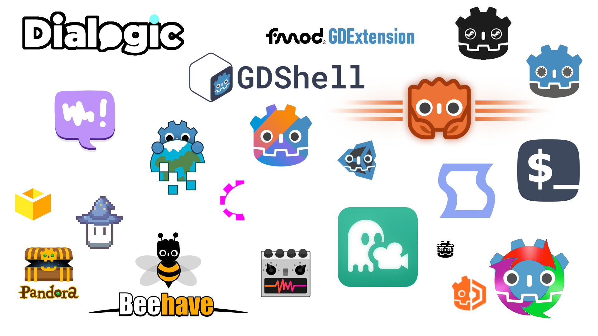

---

# Workflow addons

Accellarate and automate common processes.

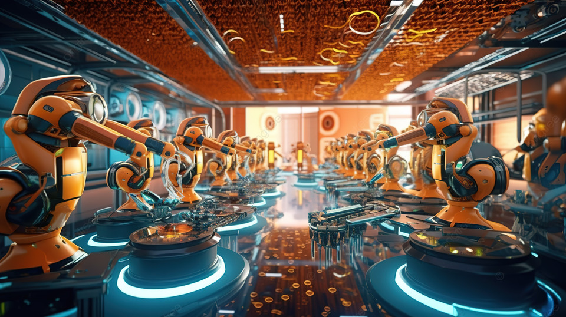

---

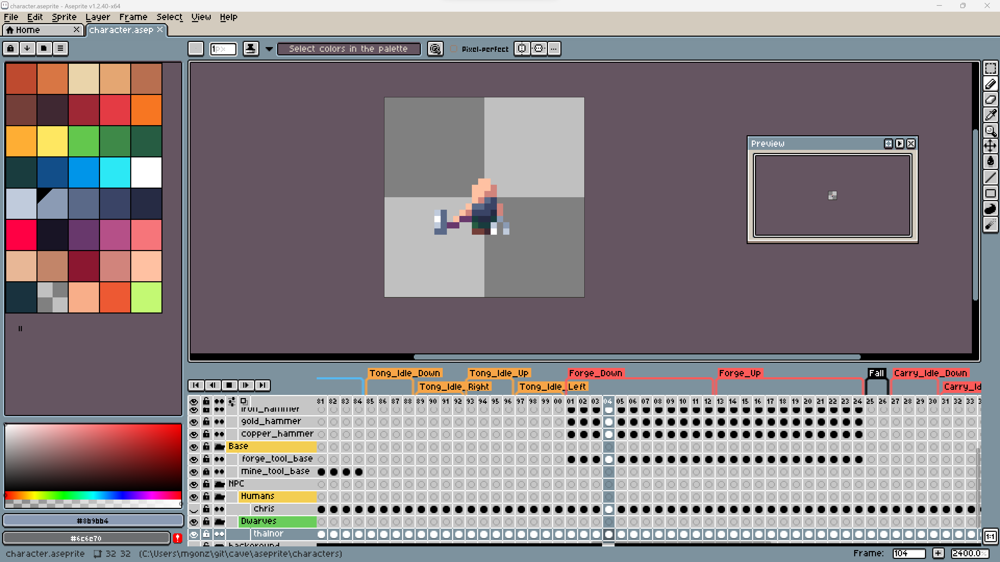

---


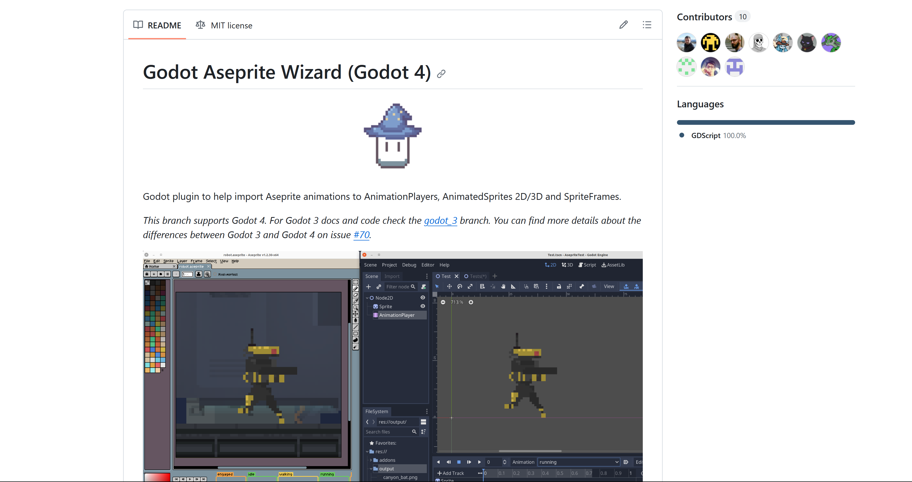

---

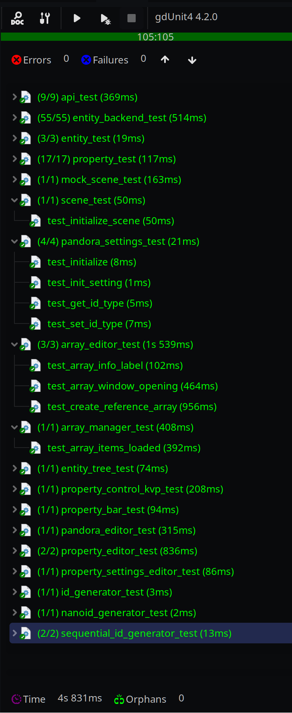

# Unit Testing

- `bitwes/Gut`
- `MikeSchulze/gdUnit4`
- `Spycemyster/GDMUT`
- `watplugin/wat`

---

# Integrations

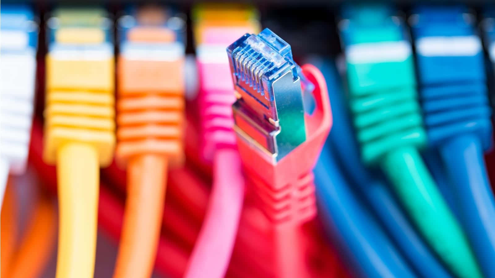

Connect any tool directly into Godot Engine.

---

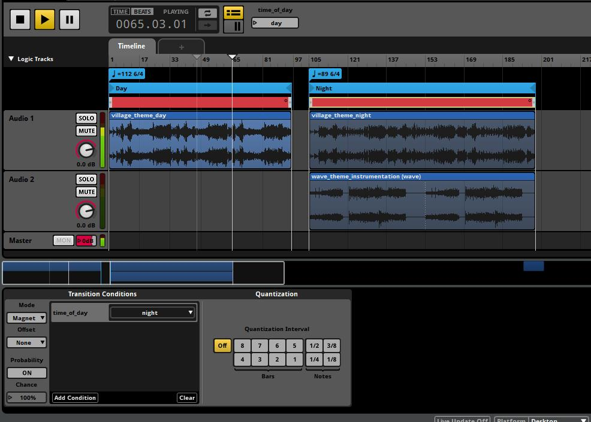

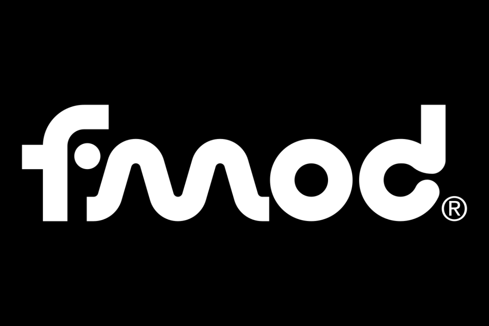

`utopia-rise/fmod-gdextension`

`alessandrofama/fmod-for-godot`


---


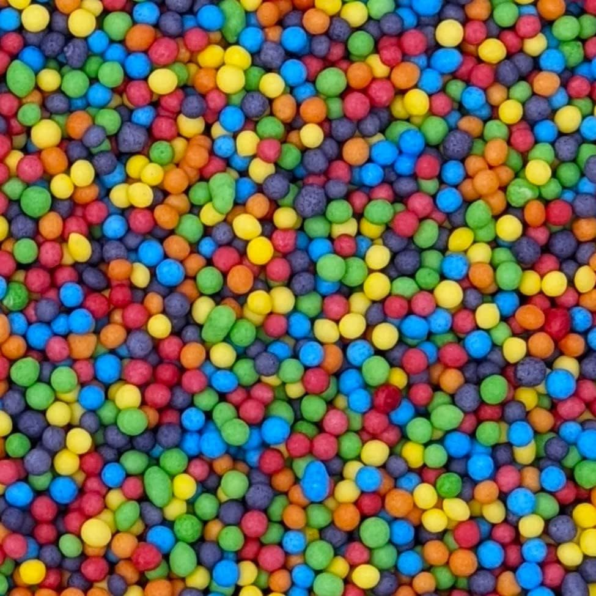


Godot extension that integrates the Jolt physics engine.

`godot-jolt/godot-jolt`

<br/>

- works with `CharacterBody3D` and other familiar Godot nodes out of the box (drop-in replacement)


---

 # Other types of addons

- editor extensions
- templates
- shaders
- custom nodes
- themes

---
# Addon discovery

- Official: https://godotengine.org/asset-library
- Useful: https://github.com/godotengine/awesome-godot
- Goldmine: https://github.com/search?q=godot%2Baddon
- Supportive: https://itch.io/search?q=godot%2Baddon
- Bonus: https://godotshaders.com/


---

# Is there an addon for that?

| S | M | L | XL |
|---|---|---|----|
| fix translation | add new language | add voicelines | dialogue system |
| change color of sword| update sword animation|add new weapon type| itemization system|
| fix sound timing| add new sound effect| dynamic sound playback | integrating FMOD |
| fix level collision | rework existing level | add new level | procedural level generation |
---

<center>

# Production Point Principle

### by 🖤 HeartBeast


<u>heartgamedev.substack.com/p/production-point</u>
</center>

---

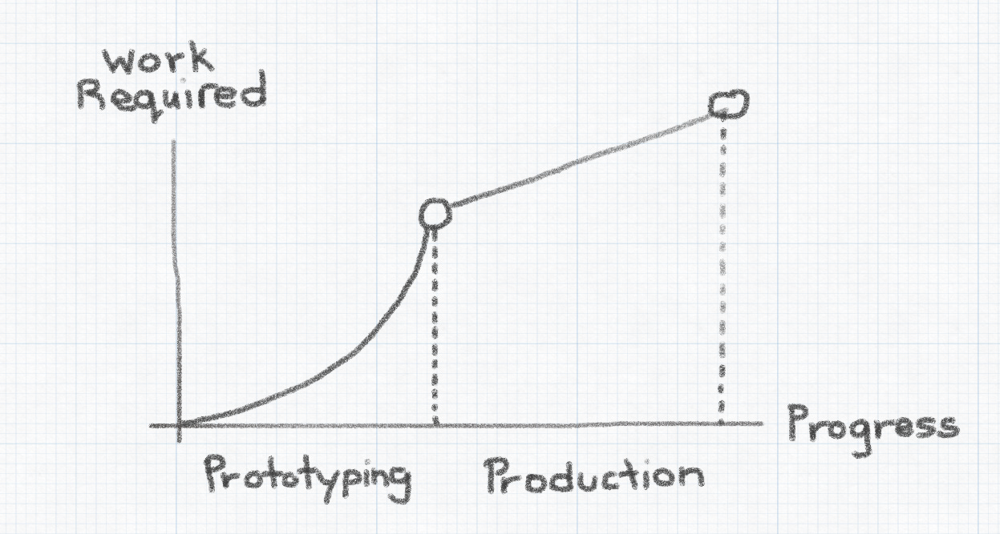

<div style="font-size:22px;float:right; margin-top:-50px">source: <u>heartgamedev.substack.com/p/production-point</u></div>

---
# Content Pipeline

> Structured sequence of stages, tools, and methodologies used to conceptualize, design, develop, test, and deploy game content with consistency.

<b style="margin-left:50px;">&#9135; ChatGPT</b>

---

# There is no silver bullet

- addons may become outdated
- addons may have bugs
- addons can have different design goals
- addons can break your game

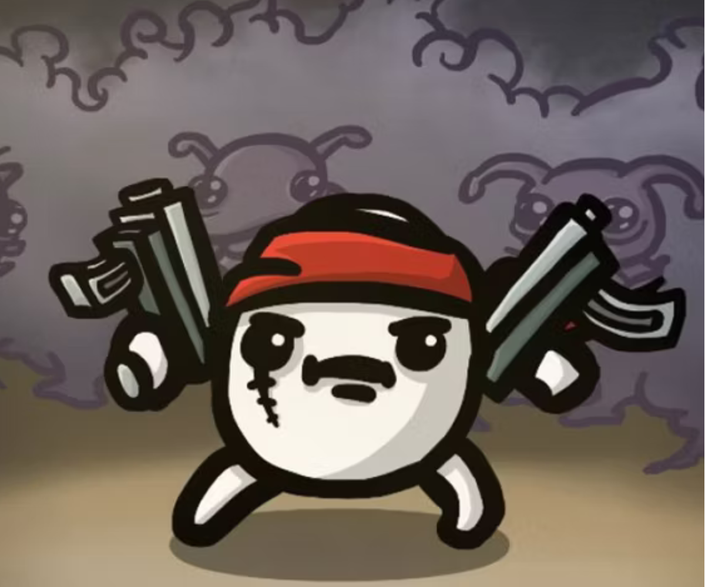

---


<div style="color:white; margin-top:-60px">
<blockquote><p><i>You need to be twice as smart as the person who wrote the code in order to debug it.</i></p></blockquote>

<b style="margin-left:50px;">&#9135; Kernighan's Law</b>
</div>

---

# The DIY approach

- no external dependencies
- consistent standard & practices across all code
- any bug can be backtraced back to you (or Godot 😇)
- no docs to learn required

**BUT**

```
You need to know how to build it.
```

---

# When to probably use addons

- You do not want to build it yourself
- You have no time to build it yourself
- You want to build games, not technical systems
- You like to explore how others have solved a problem
- You want to get a headstart (e.g. gamejams) 

---

# Properties of a good addon

A **good** addon should be:

- useful
- well-documented
- well-presented
- tested
- **maintained** or **archived**
- compatible

---

# README.md

1. Recognizable Addon Logo
2. gifs and images showing what your addon does
3. how to install
4. compatibility matrix
5. how to contribute guide
6. wiki (e.g. via `docsify`)

---

# Interesting Proposals

- `#8114` Better discoverability of curated add-ons into editor
- `#7925` add-on manifests
- `#1205` New Add-On (sub-project) system
- `#831` Add support for global plugins/universal addons
- `#3367` Add ExtensionDevelopmentPlugin for in-editor native extension development


_source: <u>github.com/godotengine/godot-proposals</u>_

---
# Questions?


### youtube.com/@bitbraindev